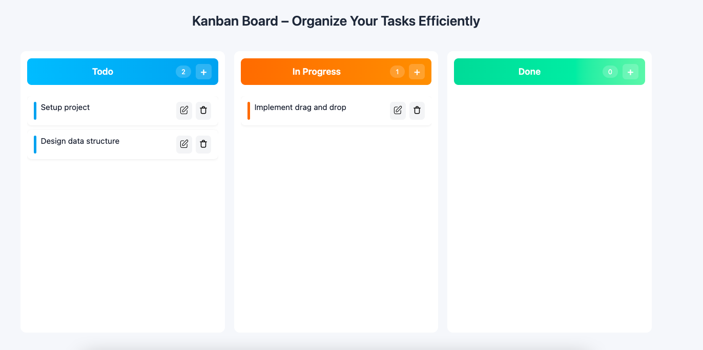

# Kanban Board (React + TypeScript)

A simple **Kanban Board** application built using **React (Vite) + TypeScript**.
The project focuses on clean UI, basic task management, and smooth drag-and-drop interaction by `@dnd-kit` library.

---

## ✨ Features

* Light theme UI
* Column-based task management
* Add, edit, and delete tasks using modal pop-ups
* Drag and drop cards **within the same column** and **across columns**
* Confirmation modal before deleting a task
* Built using React Portals for modals
* CSS Flexbox-based layout

---

## 🗂 Project Structure (High Level)

* `components/` – UI components (Board, Column, Card, Modal)
* `data/` – Initial board data
* `types/` – TypeScript types
* `utils/` – Small helper functions
* `assets/` – Icons and static assets

---

## 🖼 Screenshots

Example usage in markdown:

```md


```

---

## ⚠️ Images Not Visible in VS Code?

If images are **not visible in VS Code preview**, check the following:

* Image paths are **relative to README.md**
* Folder name and file name spelling matches exactly
* Use **lowercase filenames** (recommended)
* Example correct path:

```md

```

👉 Tip: Right-click the image file in VS Code → **Copy Relative Path** and paste it into README.

---

## 🚀 Getting Started

```bash
npm install
npm run dev
```

Open the app in the browser using the local URL shown in terminal.

---

## 🎯 Purpose of the Project

This project was built to:

* Practice React + TypeScript structure
* Understand drag-and-drop behavior
* Implement reusable UI components
* Follow clean and readable frontend practices

---

## 🔮 Possible Improvements

* Keyboard accessibility
* Persist data using localStorage or backend
* Animations for add/remove actions
* Mobile responsiveness improvements

---

## 👤 Author

**Anilraj Meena**
Frontend Developer (React.js)
